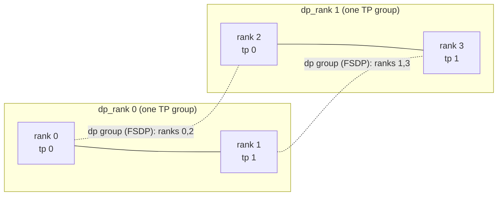
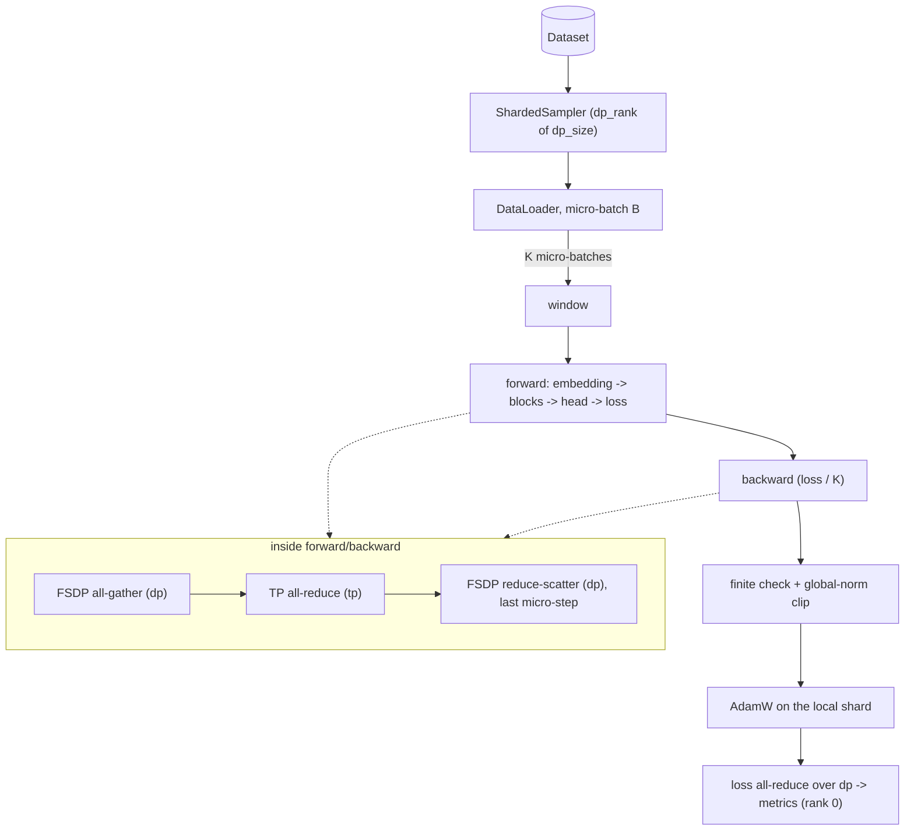

# Architecture: 2D-Parallel (FSDP × Tensor Parallel) Training

This document explains how the system is organised, exactly which collective
operations fire and when, how memory moves through a training step, the major
design decisions (with the alternatives we rejected), and the known limitations.
It is written so a new engineer can understand, debug, and extend the system
without reading every line of code.

---

## 1. System overview

We organise `world_size = dp_size × tp_size` GPUs into a 2D process mesh:

```
                          tp axis  (tensor parallel — shards ONE layer's weights)
                     ┌──────────────┬──────────────┬──────────────┬──────────────┐
                     │  tp_rank=0   │  tp_rank=1   │  tp_rank=2   │  tp_rank=3   │
   ┌─────────────────┼──────────────┼──────────────┼──────────────┼──────────────┤
 d │  dp_rank=0      │   GPU 0      │   GPU 1      │   GPU 2      │   GPU 3      │  ← one TP group
 p │  (FSDP shard 0) │              │              │              │              │     (one node / NVLink island)
   ├─────────────────┼──────────────┼──────────────┼──────────────┼──────────────┤
 a │  dp_rank=1      │   GPU 4      │   GPU 5      │   GPU 6      │   GPU 7      │  ← another TP group
 x │  (FSDP shard 1) │              │              │              │              │
 i └─────────────────┴──────────────┴──────────────┴──────────────┴──────────────┘
 s   (data parallel — FSDP shards params/grads/optimizer state across this axis)

   global_rank = dp_rank * tp_size + tp_rank        (row-major: tp varies fastest)
```

Two orthogonal kinds of sharding compose:

* **Along `tp`** — a single transformer layer's weight matrices are split across
  GPUs (column-parallel `wq/wk/wv/gate/up`, row-parallel `wo/down`). Every TP rank
  holds a *different slice of the same layer* and they cooperate via an
  `all_reduce` per sublayer to compute that layer's output. TP is on the critical
  path of every micro-step, so its group is placed on the fastest interconnect
  (contiguous ranks → intra-node NVLink).
* **Along `dp`** — FSDP (ZeRO-3) shards each parameter, its gradient, and its
  optimizer state across the data-parallel ranks. A layer's full parameters are
  *all-gathered just in time* for its forward/backward, used, then freed. DP
  communicates less often and tolerates slower (inter-node) links.

The residual stream stays **replicated across `tp`** (only the per-head /
inner-MLP activations are sharded), and stays **identical across one TP group's
input data** (TP ranks process the same batch; only DP ranks see different data).

Source map:

| Concern | Module |
|---|---|
| Mesh + groups | `src/parallelism/mesh.py`, `src/parallelism/process_groups.py` |
| Tensor parallel | `src/parallelism/tensor_parallel.py` |
| FSDP wrap + state dict | `src/parallelism/fsdp_utils.py` |
| Model | `src/model/{transformer,attention,mlp,embeddings}.py` |
| Step logic | `src/training/loop.py` |
| Orchestration | `src/training/trainer.py` |
| Checkpoint + recovery | `src/checkpointing/{checkpoint,recovery}.py` |
| Metrics / profiler / logging | `src/observability/*` |

### Mesh and process groups (4 ranks, `tp=2`, `dp=2`)



Solid edges are TP groups (activation all-reduces, `mesh["tp"]`); dotted edges are
FSDP groups (param all-gather / grad reduce-scatter, `mesh["dp"]`). The layout is
printed at start-up by `format_mesh_layout`.

### Data flow of one step



---

## 2. Communication schedule

What follows is the exact sequence of collectives for one optimizer step with
`grad_accum_steps = K`. **Group** is the most important column — using the wrong
group is the single hardest-to-debug 2D-parallel bug.

### Forward pass (per transformer block, repeated `n_layers` times)

| Phase | Collective | Group | Cost | Overlap |
|---|---|---|---|---|
| Block params materialise | `all_gather` (FSDP) | `dp` | `O(P_block/dp_size → P_block)` | prefetched (`forward_prefetch=True`) with prior block compute |
| Attention `wq/wk/wv` | none (input replicated) | — | — | — |
| Attention `wo` (RowParallel) | `all_reduce` | `tp` | `O(activation)` | on critical path |
| MLP `gate/up` | none (input replicated) | — | — | — |
| MLP `down` (RowParallel) | `all_reduce` | `tp` | `O(activation)` | on critical path |
| Block params free | — | — | frees `P_block` | — |

So per block the forward fires **one FSDP all-gather (dp)** + **two TP all-reduces
(tp)** — attention output and MLP output. Embedding, final norm, and LM head are
replicated (no TP collective).

### Backward pass (per block, reverse order)

| Phase | Collective | Group | Cost | Overlap |
|---|---|---|---|---|
| Block params re-materialise | `all_gather` (FSDP) | `dp` | `O(P_block)` | prefetched (`BACKWARD_PRE`) with current block backward |
| RowParallel input-grad | (none; produced sharded) | — | — | — |
| ColumnParallel input-grad | `all_reduce` | `tp` | `O(activation)` | on critical path |
| Gradient reduction | `reduce_scatter` (FSDP) | `dp` | `O(P_block → P_block/dp_size)` | overlapped with next block backward |

**Gradient accumulation:** for micro-batches `0..K-2` the backward runs inside
`model.no_sync()`, which **defers the FSDP `reduce_scatter`** — gradients
accumulate locally and only the final (Kth) backward triggers the `dp`
reduce-scatter. The **TP `all_reduce` is NOT deferred** by `no_sync()`; it fires on
every micro-batch because it is part of the layer's forward/backward math, not a
gradient sync. (See `src/training/loop.py` docstring — "the TP asymmetry".)

### Optimizer step

| Phase | Collective | Group | Cost |
|---|---|---|---|
| Finite check | `all_reduce(MIN)` of a 0/1 flag | world | `O(1)` |
| Global grad-norm clip | `all_reduce` of partial norm² | FSDP only: `dp`; FSDP×TP: `dp` **and** `tp` (`grad_utils._fsdp_tp_clip`); TP only: `tp` | `O(1)` |
| Loss reporting | `all_reduce(SUM)/dp_size` | `dp` | `O(1)` |
| Parameter update | none (local on the resident shard) | — | `O(P/dp_size)` |

> **Why these groups:** loss is averaged over `dp` only (TP ranks compute the same
> loss); the finite check is over the **world** group so a NaN anywhere halts
> everyone together; the grad norm reduces over `dp` (FSDP) and additionally over
> `tp` for the TP-sharded params. (`FSDP.clip_grad_norm_` alone reduces only over
> the FSDP group; relying on it in 2D was a bug found in the audit — see
> AUDIT_FINDINGS.md.) PARALLELISM.md lists the *measured* collective counts, which
> refine the per-block tables above. Reduce over the wrong group and the
> number looks plausible but is silently wrong.

---

## 3. Memory lifecycle per training step

Let `P` = total params, `dp` = `dp_size`, `P_block` = largest block's params,
`A` = peak activation bytes for one block. With FSDP `FULL_SHARD` + bf16 params +
fp32 optimizer master:

| Stage | Resident (per GPU) | Transient |
|---|---|---|
| Idle (between steps) | params `P/dp` (bf16) + grads `P/dp` (fp32) + Adam `2·P/dp` (fp32) + fp32 master `P/dp` | — |
| Forward, block *i* | resident shards | `+P_block` (bf16, the gathered block) `+A` (its activations) |
| End of forward | resident shards | `+Σ stored activations` (bounded by activation checkpointing) |
| Backward, block *i* | resident shards | `+P_block` (re-gathered) `+A` (recomputed if AC on) `+P_block` grad before reduce-scatter |
| After reduce-scatter | resident shards (grad shard now populated) | freed |
| Optimizer step | resident shards | negligible |

Headline properties:

* **Parameter memory is `P/dp + P_block`**, not `P`. That is the whole point of
  per-block FSDP wrapping: only one block is ever fully materialised at a time
  (`limit_all_gathers=True` caps concurrent all-gathers so deep models don't stack
  `n_layers · P_block` transient buffers).
* **TP further divides `P_block` by `tp_size`** — each TP rank's slice of a block
  is `P_block/tp_size`, so the transient all-gather term is `P_block/tp_size`.
* **Activation memory** is the usual `O(batch · seq · d_model · n_layers)`;
  activation checkpointing drops the stored term to `O(batch · seq · d_model)`
  (one block) at the cost of one extra forward in backward. Sequence parallelism
  further shards the norm activations by `tp_size`.

---

## 4. Design decisions log

Each entry: **decision — alternatives considered — rationale.**

### 4.1 FSDP (ZeRO-3) over DDP for the DP axis
**Alternatives:** DDP (full replication), ZeRO-1/2 (shard only optimizer/grad).
**Rationale:** DDP holds `O(P)` params + `O(P)` grads + `O(2P)` Adam state on
*every* GPU — a 7B model exceeds 80 GB before activations. FSDP shards all three to
`O(P/dp)`, all-gathering a layer's params just in time. ZeRO-1/2 still replicate
params (`O(P)`), which is the dominant term at scale. FSDP is the only option that
makes 7B fit with room for activations.

### 4.2 Per-`TransformerBlock` auto-wrap, not whole-model wrap
**Alternatives:** one FSDP unit for the entire model.
**Rationale:** a single unit all-gathers *every* parameter at once for the forward,
so the transient term becomes `O(P)` — defeating the memory saving. Wrapping each
block makes the transient term one block and lets block *i+1*'s all-gather overlap
block *i*'s compute (prefetch). Trade-off: more, smaller collectives (slightly
higher launch overhead), which prefetch + `limit_all_gathers` manage.

### 4.3 `use_orig_params=True`
**Alternatives:** the legacy flat-`FlatParameter` view (`False`).
**Rationale:** (1) it is **required** to compose with tensor parallelism — TP
weights are DTensors and only the orig-params path keeps them addressable for FSDP
to further shard along `dp`; (2) it preserves the original `nn.Parameter` identity
so the optimizer can build sensible decay/no-decay param groups *after* wrapping.
Cost: a per-forward writeback to sync orig params to the flat buffer. (An older
note here blamed a torch-2.3 CPU bug; on torch 2.6 the combination works, §6.)

### 4.4 `reduce_dtype=float32` while `param_dtype=bfloat16`
**Alternatives:** bf16 reduction (cheaper bandwidth).
**Rationale:** gradient reduction sums `dp_size` partial gradients; in bf16 the
7-bit mantissa cannot represent the running sum of many small magnitudes, biasing
the gradient by an amount that grows with `dp_size` (measurable at 64+ ranks). fp32
reduction keeps the estimate unbiased. The fp32 optimizer master copy is what makes
bf16 training stable **without** loss scaling (bf16 has fp32's exponent range, so
no `GradScaler` is needed — unlike fp16).

### 4.5 DTensor `parallelize_module` for the production TP path; hand-rolled linears for the reference
**Alternatives:** only hand-rolled `all_reduce`, or only DTensor.
**Rationale:** DTensor's `ColwiseParallel`/`RowwiseParallel` compose with FSDP,
install the right gradient hooks, and overlap communication automatically — the
right choice for the trainer. But they are opaque. We *also* ship hand-rolled
`ColumnParallelLinear`/`RowParallelLinear` built on four explicit
`autograd.Function` collectives so every byte of forward/backward comm is visible
and unit-testable with `gradcheck`. Both implement the same math; the hand-rolled
versions are the executable specification.

### 4.6 Embedding and LM head left **replicated** (not vocab-parallel) by default
**Alternatives:** vocab-parallel embedding + parallel cross-entropy (`loss_parallel`).
**Rationale:** vocab parallelism needs an `all_reduce` over the (large) logits and
a vocab-parallel cross-entropy on the critical path, plus an all-gather of the
input embedding. For the target model sizes, the redundant *replicated* compute of
the embedding/head on each TP rank is cheaper than that collective, and FSDP
already shards these big matrices across `dp`. A `loss_parallel` keyword exists on
`apply_tensor_parallelism` but is reserved: it raises `NotImplementedError`.

### 4.7 Attention reshapes with `-1` for the head count
**Alternatives:** hard-code `n_heads`, or adjust `n_heads` after parallelisation.
**Rationale:** after `ColwiseParallel` shards `wq/wk/wv`, each TP rank's projection
emits only `n_heads/tp_size` heads (the library returns the *local* tensor). Hard-
coding `self.n_heads` would be wrong on every rank. Reshaping with `view(b, s, -1,
head_dim)` infers the local head count from the tensor width, making the attention
module TP-degree-agnostic. The GQA repeat factor is likewise computed from runtime
shapes.

### 4.8 `SHARDED_STATE_DICT` for training checkpoints, `FULL_STATE_DICT` for export
**Alternatives:** always full, or a single-writer rank-0 checkpoint.
**Rationale:** `FULL_STATE_DICT` all-gathers every parameter to rank 0 (`O(P)`
memory there, serial write) — unusable as a frequent training checkpoint at scale.
`SHARDED_STATE_DICT` lets each rank write its `O(P/dp)` shard in parallel: fast,
storage-cheap, the only sane periodic-checkpoint option. We reserve the slow,
portable full export for the final model and for resuming on a *different*
topology.

### 4.9 Atomic writes + a `_SUCCESS` marker after a barrier
**Alternatives:** write files in place; trust the newest directory.
**Rationale:** a job killed mid-write must never leave a half-written checkpoint
that a later resume mistakes for valid. Every file is written `*.tmp` then
`os.replace`'d (atomic on POSIX); rank 0 writes `_SUCCESS` only **after a barrier**
confirms all ranks flushed their shards. Recovery trusts only marked checkpoints
and scans newest-first, so it never resumes the one the crash was writing.

### 4.10 Skip FSDP when `dp_size == 1` (pure TP)
**Alternatives:** always wrap (a 1-process FSDP unit).
**Rationale:** FSDP over a 1-rank DP group shards nothing and only adds per-step
bookkeeping/collectives over a trivial group. For pure-TP runs we use the TP model
directly; `no_sync`/clip/state-dict helpers all detect the non-FSDP case, so the
loop is otherwise unchanged. (It does not matter for correctness on torch 2.6: 2D runs fine.)

---

## 5. Determinism

Given the same seed, config and topology, runs are reproducible, including across
resumes:

* **Seeding.** Model initialisation uses `seed` on *every* rank (so all DP replicas,
  and the shards FSDP/TP cut out of the same full tensors, come from one
  initialisation); afterwards each rank is re-seeded with `seed + dp_rank`. DP ranks
  therefore see different data order, while TP ranks (same `dp_rank`) stay in
  lockstep for every non-sharded stochastic decision. (Before the audit the
  per-`dp_rank` seed was applied *before* model construction, so `NO_SHARD`/hybrid
  replicas started from different weights.)
* **Data positioning on resume** is exact: the trainer replays the window stream so
  step `S` consumes the same sequences whether or not the run restarted
  (`Trainer._fast_forward_data`).
* **RNG state** (Python/NumPy/torch/CUDA) is checkpointed per rank and restored.
* The **LR schedule** is a pure function of the step.

The resume benchmark (BENCHMARKS.md) shows the post-resume loss curve bit-identical
to the continuous run on CPU/gloo (single-run measurement; GPU kernels and NCCL
reduction order can break bit-exactness).

---

## 6. Known limitations & future work

* **Earlier notes claimed 2D FSDP×TP and FSDP checkpoint/resume were GPU-only
  because of torch-2.3 bugs.** On the torch 2.6 CPU/gloo environment used for this
  audit, both run: 2D loss and global grad-norm match the single-process reference
  (`tests/integration/test_parallel_equivalence.py`, 4 ranks) and FSDP resume is
  within the test tolerance on CPU (a 2-rank smoke run of the resume benchmark on the `tiny` preset showed 0.0 loss difference; the full-size dp=2 resume benchmark did not complete). What *does* remain GPU-only is the portable re-keyed
  optimizer-state path in `fsdp_utils.get_optimizer_state_dict`: without CUDA the
  code stores each rank's raw `optimizer.state_dict()` (`__fsdp_per_rank__`), which is
  topology-locked. The CUDA path (`FSDP.optim_state_dict`) was not run here.
* **Checkpoints cannot be resharded.** `load_checkpoint` now rejects a different
  `(world, tp, dp)` explicitly; `full=True` save/load exists in the API but the
  trainer never calls it.
* **Durability.** Tensor files are written with `os.replace` but not `fsync`ed
  (only `meta.json` and `_SUCCESS` are), so a *process* crash is handled and a power
  loss is not guaranteed to be.
* **Signals.** Only `KeyboardInterrupt` triggers a final checkpoint; `SIGTERM` does
  not.
* **No pipeline parallelism.** We do 2D (DP×TP), not 3D. Pipeline parallelism would
  shard *layers* across stages to cut activation memory further and is the natural
  next axis; it needs a micro-batch scheduler (1F1B) and is out of scope.
* **No expert parallelism / MoE.**
* **Sequence parallelism** is implemented behind a flag; see PARALLELISM.md for its
  verified status.
* **HYBRID_SHARD** needed a 2-D mesh that the wrapper did not build (it raised
  `ValueError` for any `dp_size > 1`); fixed and covered by a 4-rank equivalence
  test (2 replicas × 2-way shard). Not run on multi-node NCCL.
* **Elastic training** is supported at the checkpoint level (restart → recover the
  last valid checkpoint → resume), but we do not implement a live membership-change
  protocol (rendezvous re-formation is delegated to `torchrun --max-restarts`).

---

## 7. How to extend

* **New model architecture:** keep the `TransformerBlock` submodule names
  (`attention`, `mlp`, `attention_norm`, `mlp_norm`) and the linear names so the TP
  plan in `apply_tensor_parallelism` applies unchanged; reshape attention heads
  with `-1`.
* **New optimizer:** add it to `build_optimizer`; build param groups *after* FSDP
  wrap. If it needs a global per-parameter statistic (like LAMB's trust ratio),
  reduce it across the `dp`/`tp` groups or accept the documented per-shard
  approximation.
* **New parallelism axis (e.g. pipeline):** add a mesh dimension in
  `build_device_mesh`, expose its group on `ProcessContext`, and thread it through
  the step like `dp`/`tp`. The "always name the group" discipline is what keeps a
  third axis from introducing wrong-group bugs.
