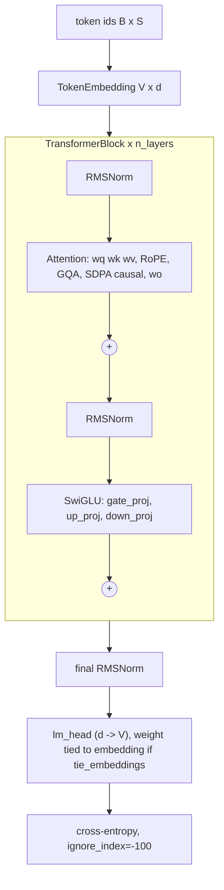

# Model

`src/model/` implements a LLaMA-style decoder-only transformer in plain PyTorch.
Nothing in it knows about distributed training except `VocabParallelEmbedding`
(unused by the trainer, see below): tensor parallelism is applied *afterwards* by
rewriting the module's linears (`src/parallelism/tensor_parallel.py`), which is why
the module and attribute names here are load-bearing.

## Structure

The block is pre-norm: `h = x + attn(norm1(x))`, `out = h + mlp(norm2(h))`
(`src/model/transformer.py::TransformerBlock.forward`).

## Components (all verified against the source)

| Piece | File | Details |
|---|---|---|
| `RMSNorm` | `transformer.py` | Computes in fp32 (`x.float()`), casts back to the input dtype, then multiplies by the learned weight. No bias. |
| `TokenEmbedding` | `embeddings.py` | `nn.functional.embedding`, init `N(0, 0.02)`. |
| RoPE | `embeddings.py::precompute_rope_cache`, `apply_rotary_emb` | "Rotate-half" layout (first/second half of the head dim are the pair), the Hugging Face / GPT-NeoX convention, **not** the interleaved original. Cache of `max_seq_len` cos/sin in fp32, registered as **non-persistent buffers** (not in `state_dict`). Requires even `head_dim`. |
| `Attention` | `attention.py` | Separate `wq` (d→d), `wk`, `wv` (d→`n_kv_heads·head_dim`), `wo` (d→d). GQA via `repeat_kv` (expand+reshape, so K/V are materialised `n_rep` times). Uses `F.scaled_dot_product_attention(is_causal=True)`; attention dropout only in train mode. No KV cache (training only). |
| `SwiGLUMLP` | `mlp.py` | `down(silu(gate(x)) * up(x))`; three matrices. |
| `Transformer` | `transformer.py` | Embedding → blocks → RMSNorm → `lm_head`. Returns `(logits, loss)`; loss is `None` unless `labels` is given. |

### Initialisation

`Transformer.__init__` applies `N(0, 0.02)` to every `nn.Linear` (zero bias), then
`_scale_residual_init` re-draws `attention.wo` and `mlp.down_proj` with
`std = 0.02 / sqrt(2·n_layers)` (GPT-2 style residual scaling). Embedding is
`N(0, 0.02)`; with `tie_embeddings=True` the LM head *is* the embedding tensor
(`lm_head.weight = tok_embeddings.weight`).

### How the shapes survive tensor parallelism

After `ColwiseParallel` shards `wq/wk/wv`, each TP rank's projection emits
`n_heads / tp` (resp. `n_kv_heads / tp`) heads. `Attention.forward` therefore
reshapes with `view(bsz, seqlen, -1, head_dim)` and derives the GQA repeat factor from
the *local* tensor shapes (`attention.py`). This makes the module TP-degree
agnostic, at the cost of requiring `n_kv_heads % tp == 0` — which is now checked
up front by `TrainingConfig.validate` (previously a cryptic DTensor error).

### Embedding / LM head are replicated, not vocab-parallel

`apply_tensor_parallelism` only touches the seven linears per block. The embedding,
final norm and LM head are replicated across TP ranks (and FSDP-sharded across DP).
`VocabParallelEmbedding` exists in `embeddings.py` but `Transformer` does not use
it, and there is no loss-parallel cross-entropy: the logits (`B·S·V`) are
materialised in full on every TP rank. Consequence for memory: at `V = 50304`
and `B·S = 16·1024` the logits are `16·1024·50304·4 B ≈ 3.3 GB` per rank in fp32 (half
that in bf16, before the loss upcasts); this is
the first thing that breaks when you raise `micro_batch_size`. (`apply_tensor_parallelism(..., loss_parallel=True)` used to be
accepted and silently ignored; it now raises `NotImplementedError`.)

## Parameter counts (computed from the code)

Exact counts instantiate `build_model` on the `meta` device; "analytic" is
`ModelConfig.num_parameters()` (used for MFU) which ignores the norm vectors.
Per-layer = `4·d² (MHA) + 3·d·ffn + 2·d`; the table lists the exact per-layer sum.

| Config | Embedding | Per layer | Layers | Exact total | Analytic | FLOPs/token (`estimate_flops_per_token`) |
|---|---|---|---|---|---|---|
| test_tiny | 16,384 | 36,992 | 2 | 90,432 | 90,112 | 638,976 |
| base | 24,576,000 | 7,079,424 | 12 | 109,529,856 | 109,510,656 | 883,556,352 |
| 125m | 38,633,472 | 9,438,720 | 12 | 151,898,880 | 151,879,680 | 1,024,524,288 |
| 7b | 131,072,000 (+131,072,000 untied head) | 202,383,360 | 32 | 6,738,415,616 | 6,738,149,376 | 46,871,347,200 |

The `125m.yaml` model is ~152M parameters, not 125M: GPT-2-small's 124M uses a
4×-expansion GELU MLP (2 matrices); this config uses SwiGLU at width 3072 (3
matrices) and a 50304 vocabulary. FLOPs per token is `6·N_analytic + 12·L·d·max_seq_len`
(`src/observability/metrics.py`), i.e. the usual 6N plus the attention-score term;
note `max_seq_len`, not the actual `seq_len`, enters the formula.

Benchmark presets used in this repo (`benchmarks/_common.py`, exact counts from
`meta`): `tiny` 90,432; `small` (d=256, L=4, 8/4 heads, ffn 704, V=4096) 4,000,000;
`mid` (d=512, L=8, 8/4 heads, ffn 1408, V=8192) 27,795,968.
